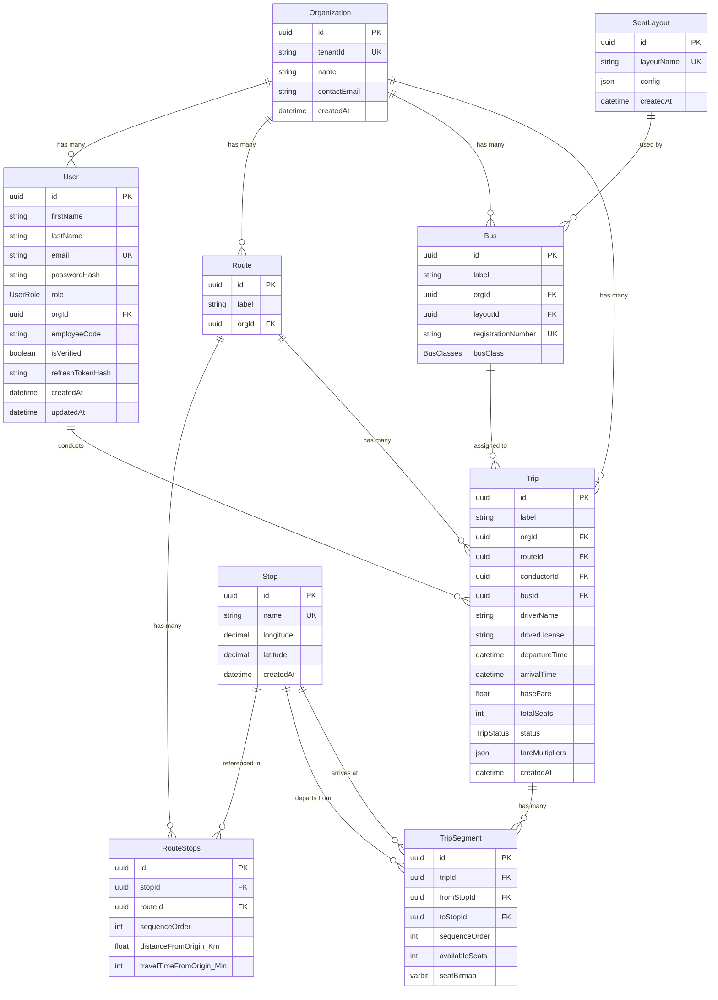

# 🚌 EasyBus Backend — API Documentation

> **Version:** 1.0.0  
> **Base URL:** `http://localhost:3000`  
> **API Prefix:** `/api`

---

## Table of Contents

- [Project Overview](#project-overview)
- [Tech Stack](#tech-stack)
- [Architecture & Folder Structure](#architecture--folder-structure)
- [Getting Started](#getting-started)
- [Authentication & Authorization](#authentication--authorization)
- [Standard API Response Format](#standard-api-response-format)
- [Error Handling](#error-handling)
- [Database Schema](#database-schema)
- [API Endpoints](#api-endpoints)
  - [Auth Module](#1-auth-module)
  - [User Module](#2-user-module)
  - [Organization Module](#3-organization-module)
  - [Seat Layout Module](#4-seat-layout-module)
  - [Route & Stop Module](#5-route--stop-module)
  - [Bus Module](#6-bus-module)
  - [Trip Module](#7-trip-module)
- [Enums & Constants](#enums--constants)
- [Environment Variables](#environment-variables)

---

## Project Overview

**EasyBus** is a multi-tenant bus transportation management backend system. It enables bus transport organizations to manage their fleet, routes, trips, and seat availability. The system supports multiple user roles (from super admins to passengers) and provides features like:

- **Multi-tenant architecture** — Each bus organization operates within its own tenant, identified by a unique `tenantId`.
- **Role-based access control (RBAC)** — Hierarchical roles (`SUPER_ADMIN > ORG_ADMIN > OPERATOR > CONDUCTOR > PASSENGER`) with weighted permissions to prevent privilege escalation.
- **JWT-based authentication** — Access tokens and refresh tokens stored as `httpOnly` cookies with email verification flow.
- **Dynamic seat layout system** — Configurable seat layouts with grid-based positioning, multi-deck support, and seat types (SEAT, SLEEPER, DRIVER, CONDUCTOR, DOOR).
- **Seat availability via bitmaps** — Trip segments use `varbit` columns in PostgreSQL to track per-seat availability across route segments, enabling efficient seat-level booking queries.
- **Route & stop management** — Named stops with optional GPS coordinates, routes composed of ordered stops with cumulative distance and travel time tracking.
- **Trip scheduling with overlap detection** — Trips are validated against conductor and bus schedules to prevent double-booking. Arrival time is auto-calculated from route data.
- **Trip search** — Raw SQL queries to find trips between two stops on a given date, with calculated distance, travel time, and minimum available seats across all leg segments.

---

## Tech Stack

| Layer            | Technology                                                                     |
| ---------------- | ------------------------------------------------------------------------------ |
| **Runtime**      | Node.js with TypeScript (ESM modules)                                          |
| **Framework**    | Express.js v5                                                                  |
| **Database**     | PostgreSQL (via `pg` driver + `@prisma/adapter-pg`)                            |
| **ORM**          | Prisma v7 (with custom `PrismaPg` adapter)                                     |
| **Validation**   | Zod v4                                                                         |
| **Auth**         | JWT (`jsonwebtoken`) + `bcrypt` for password hashing                           |
| **Email**        | Nodemailer (Gmail transport)                                                   |
| **Logging**      | Pino + pino-http                                                               |
| **Linting**      | ESLint + Prettier                                                              |
| **Git Hooks**    | Husky + lint-staged + commitlint (conventional commits)                        |
| **Dev Tooling**  | `tsx` (watch mode), `pino-pretty`                                              |

---

## Architecture & Folder Structure

The project follows a **modular, layered architecture** with clear separation of concerns:

```
src/
├── app.ts                     # Express app setup, middleware, route mounting
├── server.ts                  # HTTP server startup
├── config/
│   ├── env.ts                 # Environment variable validation (Zod) & typed config export
│   └── prisma.ts              # Prisma client initialization with PrismaPg adapter
├── middleware/
│   ├── auth.middleware.ts      # authenticateUser (JWT from cookie) + authorizeUser (role check)
│   ├── validate.middleware.ts  # Zod schema validation middleware (body / query / params)
│   └── errorHandler.middleware.ts  # Global error handler
├── types/
│   ├── utils.types.ts          # HttpStatusCode, ValidationTarget, AuthUser, etc.
│   └── express.d.ts            # Express request augmentation (req.user, req.validated)
├── utils/
│   ├── apiResponse.ts          # Standardized ApiResponse class
│   ├── apiError.ts             # Custom ApiError class (extends Error)
│   ├── asyncHandler.ts         # Wraps async route handlers to catch errors
│   ├── crypto.utils.ts         # bcrypt hashing, SHA-256 token hashing
│   └── logger.ts               # Pino logger instance
├── modules/
│   ├── common/
│   │   └── email/
│   │       ├── email.service.ts     # Nodemailer transport + sendVerificationMail
│   │       ├── email.templates.ts   # HTML email template compilation
│   │       └── mailer.types.ts      # Email option types
│   └── core/
│       ├── auth/                # Registration, login, logout, email verification
│       ├── user/                # Admin user creation (internal users)
│       ├── organization/        # Organization (tenant) management
│       ├── seatLayout/          # Bus seat layout configuration
│       ├── route/               # Routes & stops management
│       ├── bus/                 # Bus fleet management
│       └── trip/                # Trip scheduling, search, and seat availability
├── prisma/
│   ├── schema.prisma            # Database schema definition
│   └── migrations/              # Prisma migration files
├── seed/
│   ├── seed.ts                  # Database seeding script
│   └── data.txt                 # Seed data reference
└── generated/
    └── prisma/                  # Auto-generated Prisma client
```

### Each module follows the pattern:

| File                  | Responsibility                                                        |
| --------------------- | --------------------------------------------------------------------- |
| `*.router.ts`         | Express Router — defines endpoints, middleware chain                  |
| `*.controller.ts`     | Request handling — extracts data, calls service, sends response       |
| `*.service.ts`        | Business logic — validation rules, orchestration, error throwing      |
| `*.repository.ts`     | Data access — Prisma queries only, no business logic                  |
| `*.validation.ts`     | Zod schemas for request validation + type exports                     |
| `*.types.ts`          | TypeScript type definitions specific to the module                    |
| `*.utils.ts`          | Module-specific helper functions                                      |

---

## Getting Started

### Prerequisites
- Node.js v18+
- PostgreSQL database

### Installation

```bash
# Clone the repository
git clone https://github.com/jaimin-dekavadiya-simform/EasyBus_Backend.git
cd EasyBus_Backend

# Install dependencies (runs prisma generate automatically via postinstall)
npm install

# Copy environment variables
cp .env.example .env
# Edit .env with your actual values

# Run database migrations
npx prisma migrate deploy

# (Optional) Seed the database
npm run seed

# Start development server
npm run dev
```

### Available Scripts

| Script             | Command                            | Description                          |
| ------------------ | ---------------------------------- | ------------------------------------ |
| `npm run dev`      | `tsx watch src/server.ts \| pino-pretty` | Start dev server with hot reload     |
| `npm run build`    | `tsc`                              | Compile TypeScript to `dist/`        |
| `npm start`        | `node dist/server.js`              | Run production build                 |
| `npm run seed`     | `tsx src/seed/seed.ts`             | Seed the database                    |
| `npm run lint`     | `eslint src --ext .ts --fix`       | Lint and auto-fix                    |

---

## Authentication & Authorization

### Authentication Flow

1. **Registration** → User registers with email/password → Verification email is sent → User is **not** verified yet.
2. **Email Verification** → User clicks the link in the email → Token is verified → User is marked as verified.
3. **Login** → Verified user logs in → Receives `accessToken` and `refreshToken` as `httpOnly` cookies.
4. **Authenticated Requests** → The `accessToken` cookie is automatically sent with each request and validated by the `authenticateUser` middleware.
5. **Logout** → Clears both cookie tokens.

### JWT Token Strategy

| Token               | Storage     | Expiry (default) | Payload                              |
| -------------------- | ----------- | ----------------- | ------------------------------------ |
| Access Token         | httpOnly cookie | `1d`          | `{ userId, role, orgId }`            |
| Refresh Token        | httpOnly cookie | `7d`          | `{ userId }`                         |
| Verification Token   | URL query param | `5m`          | `{ userId }`                         |

> **Note:** The refresh token hash is stored in the database (`users.refresh_token_hash`) using SHA-256.

### Role Hierarchy & Weights

Roles have numeric weights used to prevent privilege escalation (a user cannot create another user with a role of equal or higher weight):

| Role            | Weight | Description                                         |
| --------------- | ------ | --------------------------------------------------- |
| `SUPER_ADMIN`   | 50     | Platform-wide admin, can manage all organizations   |
| `ORG_ADMIN`     | 40     | Organization admin, manages their own org            |
| `OPERATOR`      | 30     | Manages routes, buses, and trips within their org    |
| `CONDUCTOR`     | 20     | Assigned to trips, manages on-board operations       |
| `PASSENGER`     | 10     | End user, registers via public registration flow     |

### Organization Context Resolution (`resolveOrgId`)

Many endpoints operate within an organization context:
- **`SUPER_ADMIN`** — Must explicitly provide `orgId` in the request body (since they span all orgs).
- **All other roles** — `orgId` is automatically resolved from the JWT token payload.

---

## Standard API Response Format

### Success Response

```json
{
  "statusCode": 200,
  "data": { ... },
  "message": "Human-readable success message",
  "success": true,
  "status": "SUCCESS"
}
```

### Success Response with Pending Verification

```json
{
  "statusCode": 200,
  "data": "user@example.com",
  "message": "User not verified",
  "success": true,
  "status": "PENDING_VERIFICATION"
}
```

### Validation Error Response

```json
{
  "success": false,
  "message": "Validation failed",
  "errors": [
    {
      "field": "email",
      "message": "Invalid email address format"
    },
    {
      "field": "password",
      "message": "Password must include uppercase, lowercase, number, special character and be at least 8 characters long"
    }
  ]
}
```

### Application Error Response

```json
{
  "success": false,
  "message": "Email already registered",
  "err": {
    "statusCode": 409,
    "message": "Email already registered",
    "success": false
  }
}
```

---

## Error Handling

The application uses a layered error handling strategy:

1. **Validation Errors (400)** — Caught in the `validate` middleware, returns structured Zod errors with field-level messages.
2. **Business Logic Errors** — Services throw `ApiError` with appropriate HTTP status codes.
3. **JWT Errors (401)** — Token expired or invalid signature errors are caught in `auth.utils.ts`.
4. **Global Error Handler** — The `globalErrorHandler` middleware catches all uncaught errors and returns a consistent response format.

### Common HTTP Status Codes Used

| Code | Constant                | Usage                                         |
| ---- | ----------------------- | --------------------------------------------- |
| 200  | `OK`                    | Successful read/update                        |
| 201  | `CREATED`               | Successful resource creation                  |
| 400  | `BAD_REQUEST`           | Invalid credentials, validation failures      |
| 401  | `UNAUTHORIZED`          | Missing or invalid auth token                 |
| 403  | `FORBIDDEN`             | Insufficient role permissions                 |
| 404  | `NOT_FOUND`             | Resource not found                            |
| 409  | `CONFLICT`              | Duplicate resource (email, registration, etc.) |
| 500  | `INTERNAL_SERVER_ERROR` | Unexpected server errors                      |

---

## Database Schema

### Entity Relationship Diagram



### Key Design Decisions

- **`seatBitmap` (varbit)** — Each trip segment stores a bitmap string where `1` = available and `0` = booked. The bitmap length equals `totalSeats` from the seat layout. This is an `Unsupported` Prisma type, so raw SQL is used for inserts and reads.
- **`fareMultipliers` (JSON)** — Stores per-seat-type fare multipliers (e.g., `{ "DEFAULT": 1.0, "SLEEPER": 1.5 }`) allowing flexible pricing.
- **`RouteStops`** — Junction table with cumulative `distanceFromOrigin_Km` and `travelTimeFromOrigin_Min` (computed from per-stop deltas during route creation).
- **`TripSegment`** — One segment per consecutive pair of stops on the route. Created transactionally when a trip is created.

---

## API Endpoints

### 1. Auth Module

**Base path:** `/api/auth`

---

#### `POST /api/auth/register`

Register a new passenger user.

- **Auth:** None
- **Validation Target:** Body

**Request Body:**
```json
{
  "firstName": "John",
  "lastName": "Smith",
  "email": "john@example.com",
  "password": "MyP@ssw0rd"
}
```

**Validation Rules:**
| Field       | Type   | Rules                                                                                          |
| ----------- | ------ | ---------------------------------------------------------------------------------------------- |
| `firstName` | string | Required, min 3 characters                                                                     |
| `lastName`  | string | Required, min 3 characters                                                                     |
| `email`     | string | Required, valid email format                                                                   |
| `password`  | string | Required, min 8 chars, must include uppercase, lowercase, digit, and special character         |

**Business Logic:**
1. Checks if user exists and is unverified → returns `PENDING_VERIFICATION` status and resends email.
2. Checks if user exists and is verified → throws `409 Conflict`.
3. Creates user with role `PASSENGER`, hashed password → sends verification email.

**Success Response (201):**
```json
{
  "statusCode": 201,
  "data": "john@example.com",
  "message": "User created successfully",
  "success": true,
  "status": "SUCCESS"
}
```

**Pending Verification Response (200):**
```json
{
  "statusCode": 200,
  "data": "john@example.com",
  "message": "User not verified",
  "success": true,
  "status": "PENDING_VERIFICATION"
}
```

**Error Responses:**
- `400` — Validation failed
- `409` — Email already registered (and verified)

---

#### `POST /api/auth/login`

Authenticate a user and receive JWT tokens as cookies.

- **Auth:** None
- **Validation Target:** Body

**Request Body:**
```json
{
  "email": "john@example.com",
  "password": "MyP@ssw0rd"
}
```

**Validation Rules:**
| Field      | Type   | Rules                                                              |
| ---------- | ------ | ------------------------------------------------------------------ |
| `email`    | string | Required, valid email format                                       |
| `password` | string | Required, same regex as registration                               |

**Business Logic:**
1. Finds user by email → `400` if not found.
2. If user is not verified → resends verification email, returns `PENDING_VERIFICATION`.
3. Compares password hash → `400` if incorrect.
4. Generates access token (payload: `userId`, `role`, `orgId`) and refresh token (payload: `userId`).
5. Hashes refresh token and stores in DB.
6. Sets both tokens as `httpOnly`, `sameSite: strict` cookies.

**Success Response (200):**
```json
{
  "statusCode": 200,
  "data": {
    "firstName": "John",
    "lastName": "Smith",
    "role": "PASSENGER",
    "id": "uuid-string",
    "email": "john@example.com"
  },
  "message": "User Authenticated Successfully",
  "success": true,
  "status": "SUCCESS"
}
```

**Response Headers (Set-Cookie):**
```
Set-Cookie: accessToken=<jwt>; HttpOnly; SameSite=Strict; Max-Age=86400000
Set-Cookie: refreshToken=<jwt>; HttpOnly; SameSite=Strict; Max-Age=604800000
```

**Error Responses:**
- `400` — Invalid credentials

---

#### `POST /api/auth/logout`

Log out the authenticated user by clearing auth cookies.

- **Auth:** Required (`authenticateUser`)

**Request Body:** None

**Success Response (200):**
```json
{
  "statusCode": 200,
  "data": {},
  "message": "User Logged out Successfully",
  "success": true,
  "status": "SUCCESS"
}
```

**Response Headers:**
```
Set-Cookie: accessToken=; HttpOnly; Secure; SameSite=Strict; Max-Age=0
Set-Cookie: refreshToken=; HttpOnly; Secure; SameSite=Strict; Max-Age=0
```

---

#### `GET /api/auth/verifyEmail`

Verify user's email address via the token sent in the verification email.

- **Auth:** None
- **Validation Target:** Query

**Query Parameters:**
| Parameter | Type   | Required | Description                     |
| --------- | ------ | -------- | ------------------------------- |
| `token`   | string | Yes      | JWT verification token from email link |

**Business Logic:**
1. Verifies the JWT token using the verification secret.
2. Extracts `userId` from the token payload.
3. Updates `isVerified = true` for the user.

**Success Response (200):**
```json
{
  "statusCode": 200,
  "data": {},
  "message": "Email Verified Successfully",
  "success": true,
  "status": "SUCCESS"
}
```

**Error Responses:**
- `401` — Token expired or invalid

---

#### `GET /api/auth/me`

Get the currently authenticated user's profile.

- **Auth:** Required (`authenticateUser`)

**Success Response (200):**
```json
{
  "statusCode": 200,
  "data": {
    "email": "john@example.com",
    "userId": "uuid-string",
    "role": "PASSENGER",
    "firstName": "John",
    "lastName": "Smith"
  },
  "message": "user authenticated",
  "success": true,
  "status": "SUCCESS"
}
```

**Error Responses:**
- `400` — User not found
- `401` — Unauthorized access

---

#### `POST /api/auth/resend-email`

Resend the verification email to a user.

- **Auth:** None
- **Validation Target:** Body

**Request Body:**
```json
{
  "email": "john@example.com"
}
```

**Validation Rules:**
| Field   | Type   | Rules                 |
| ------- | ------ | --------------------- |
| `email` | string | Required, valid email  |

**Success Response (200):**
```json
{
  "statusCode": 200,
  "data": {},
  "message": "Email Sent Successfully",
  "success": true,
  "status": "SUCCESS"
}
```

**Error Responses:**
- `400` — User does not exist

---

### 2. User Module

**Base path:** `/api/user`

---

#### `POST /api/user/createUser`

Create an internal user (non-passenger) for an organization. This is an admin-only operation used to onboard staff.

- **Auth:** Required (`authenticateUser`)
- **Authorization:** `SUPER_ADMIN`, `ORG_ADMIN`, `OPERATOR`
- **Validation Target:** Body

**Request Body:**
```json
{
  "email": "conductor@example.com",
  "firstName": "Jane",
  "lastName": "Doe",
  "role": "CONDUCTOR",
  "orgId": "uuid-of-organization",
  "employeeCode": "EMP001",
  "password": "Str0ng!Pass"
}
```

**Validation Rules:**
| Field          | Type   | Rules                                                              |
| -------------- | ------ | ------------------------------------------------------------------ |
| `email`        | string | Required, valid email                                              |
| `firstName`    | string | Required, min 3 characters                                        |
| `lastName`     | string | Required, min 3 characters                                        |
| `role`         | enum   | Required, one of `UserRole` values                                 |
| `orgId`        | string | Required, valid UUID                                               |
| `employeeCode` | string | Required, min 3 characters                                        |
| `password`     | string | Required, strong password regex                                    |

**Business Logic:**
1. **Privilege escalation check** — The target role's weight must be **less than** the creating user's weight. Creating a `PASSENGER` via this endpoint is forbidden.
2. Validates that the organization exists.
3. Checks for duplicate email.
4. Checks for duplicate employee code within the same organization.
5. Creates user with `isVerified: true` (no email verification for admin-created users).

**Success Response (201):**
```json
{
  "statusCode": 201,
  "data": {
    "firstName": "Jane",
    "lastName": "Doe",
    "email": "conductor@example.com",
    "role": "CONDUCTOR",
    "orgId": "uuid-of-organization"
  },
  "message": "User Created Scuccessfully",
  "success": true,
  "status": "SUCCESS"
}
```

**Error Responses:**
- `401` — Unauthorized creation (privilege escalation attempt)
- `404` — Organization does not exist
- `409` — Email already registered
- `409` — Employee code already registered for the organization

---

### 3. Organization Module

**Base path:** `/api/organization`

---

#### `POST /api/organization/create-organization`

Create a new organization (tenant).

- **Auth:** Required (`authenticateUser`)
- **Authorization:** `SUPER_ADMIN` only
- **Validation Target:** Body

**Request Body:**
```json
{
  "tenantId": "gsrtc",
  "name": "Gujarat State Road Transport Corporation",
  "contactEmail": "admin@gsrtc.in"
}
```

**Validation Rules:**
| Field          | Type   | Rules                    |
| -------------- | ------ | ------------------------ |
| `tenantId`     | string | Required, min 1 char     |
| `name`         | string | Required, min 1 char     |
| `contactEmail` | string | Required, valid email    |

**Business Logic:**
1. Checks if `tenantId` is already registered → `409 Conflict`.
2. Creates the organization.

**Success Response (201):**
```json
{
  "statusCode": 201,
  "data": {
    "id": "uuid-string",
    "tenantId": "gsrtc",
    "name": "Gujarat State Road Transport Corporation",
    "contactEmail": "admin@gsrtc.in",
    "createdAt": "2025-07-10T00:00:00.000Z"
  },
  "message": "Organization Created Successfully",
  "success": true,
  "status": "SUCCESS"
}
```

**Error Responses:**
- `409` — Tenant ID already registered

---

### 4. Seat Layout Module

**Base path:** `/api/seat-layout`

---

#### `POST /api/seat-layout/`

Create a new bus seat layout configuration.

- **Auth:** Required (`authenticateUser`)
- **Authorization:** `SUPER_ADMIN`, `ORG_ADMIN`
- **Validation Target:** Body

**Request Body:**
```json
{
  "layoutName": "Standard 40-Seater",
  "config": {
    "dimensions": {
      "columns": 5,
      "rows": 10,
      "noOfDecks": 1
    },
    "decks": {
      "lower": [
        {
          "id": "L1",
          "label": "1",
          "type": "SEAT",
          "row": 0,
          "col": 0,
          "rowSpan": 1,
          "colSpan": 1
        },
        {
          "id": "D1",
          "label": "Driver",
          "type": "DRIVER",
          "row": 0,
          "col": 4,
          "rowSpan": 1,
          "colSpan": 1
        }
      ],
      "upper": []
    }
  }
}
```

**Validation Rules — Layout Item:**
| Field     | Type   | Rules                                                   |
| --------- | ------ | ------------------------------------------------------- |
| `id`      | string | Required, min 1 char                                    |
| `label`   | string | Required, min 1 char                                    |
| `type`    | enum   | `SEAT`, `SLEEPER`, `DRIVER`, `CONDUCTOR`, or `DOOR`     |
| `row`     | int    | Required, non-negative                                  |
| `col`     | int    | Required, non-negative                                  |
| `rowSpan` | int    | Optional (default: 1), must be positive                 |
| `colSpan` | int    | Optional (default: 1), must be positive                 |

**Validation Rules — Top Level:**
| Field                     | Type   | Rules                          |
| ------------------------- | ------ | ------------------------------ |
| `layoutName`              | string | Required, min 1 char, unique   |
| `config.dimensions.columns` | int  | Required, positive             |
| `config.dimensions.rows`    | int  | Required, positive             |
| `config.dimensions.noOfDecks` | int | Required, positive            |
| `config.decks.lower`       | array | Required, array of layout items |
| `config.decks.upper`       | array | Optional, array of layout items |

**Business Logic:**
1. Checks for duplicate layout name → `409 Conflict`.
2. **Injects computed fields** before saving:
   - Counts `totalSeats` (items with type `SEAT` or `SLEEPER`).
   - Assigns `bitIndex` to each bookable seat (sequential, starting from 0, lower deck first then upper deck).
3. Stores the enriched config as JSON.

**Success Response (201):**
```json
{
  "statusCode": 201,
  "data": {
    "id": "uuid-string",
    "layoutName": "Standard 40-Seater",
    "config": {
      "dimensions": { "columns": 5, "rows": 10, "noOfDecks": 1 },
      "totalSeats": 40,
      "decks": {
        "lower": [
          { "id": "L1", "label": "1", "type": "SEAT", "row": 0, "col": 0, "rowSpan": 1, "colSpan": 1, "bitIndex": 0 },
          { "id": "D1", "label": "Driver", "type": "DRIVER", "row": 0, "col": 4, "rowSpan": 1, "colSpan": 1 }
        ],
        "upper": []
      }
    },
    "createdAt": "2025-07-10T00:00:00.000Z"
  },
  "message": "Seat Layout created successfully",
  "success": true,
  "status": "SUCCESS"
}
```

> **Note:** Only `SEAT` and `SLEEPER` types are considered bookable and receive a `bitIndex`. Other types (DRIVER, CONDUCTOR, DOOR) do not.

**Error Responses:**
- `409` — A layout with this name already exists

---

### 5. Route & Stop Module

**Base path:** `/api/route`

---

#### `POST /api/route/stop`

Create a new named stop (bus station/stop point).

- **Auth:** Required (`authenticateUser`)
- **Authorization:** `SUPER_ADMIN` only
- **Validation Target:** Body

**Request Body:**
```json
{
  "name": "Ahmedabad Central Bus Station"
}
```

**Validation Rules:**
| Field  | Type   | Rules                    |
| ------ | ------ | ------------------------ |
| `name` | string | Required, min 1 char     |

**Business Logic:**
1. Checks for duplicate stop name → `409 Conflict`.
2. Creates the stop.

**Success Response (201):**
```json
{
  "statusCode": 201,
  "data": {
    "id": "uuid-string",
    "name": "Ahmedabad Central Bus Station",
    "longitude": null,
    "latitude": null,
    "createdAt": "2025-07-10T00:00:00.000Z"
  },
  "message": "Stop Created Successfully",
  "success": true,
  "status": "SUCCESS"
}
```

**Error Responses:**
- `409` — Stop name already exists

---

#### `GET /api/route/stop`

Get all available stops.

- **Auth:** Required (`authenticateUser`)

**Success Response (200):**
```json
{
  "statusCode": 200,
  "data": [
    {
      "id": "uuid-string",
      "name": "Ahmedabad Central Bus Station",
      "longitude": null,
      "latitude": null,
      "createdAt": "2025-07-10T00:00:00.000Z"
    }
  ],
  "message": "Stops retrieved successfully",
  "success": true,
  "status": "SUCCESS"
}
```

---

#### `POST /api/route/create`

Create a new route with an ordered sequence of stops.

- **Auth:** Required (`authenticateUser`)
- **Authorization:** `ORG_ADMIN`, `SUPER_ADMIN`
- **Validation Target:** Body

**Request Body:**
```json
{
  "label": "Ahmedabad - Surat Express",
  "orgId": "uuid-of-org",
  "stops": [
    {
      "stopId": "uuid-stop-ahmedabad",
      "distanceFromPrevStop_Km": 0,
      "travelTimeFromPrevStop_Min": 0
    },
    {
      "stopId": "uuid-stop-vadodara",
      "distanceFromPrevStop_Km": 113,
      "travelTimeFromPrevStop_Min": 120
    },
    {
      "stopId": "uuid-stop-surat",
      "distanceFromPrevStop_Km": 163,
      "travelTimeFromPrevStop_Min": 150
    }
  ]
}
```

> **Note:** `orgId` is **optional** for `ORG_ADMIN` (resolved from JWT) but **required** for `SUPER_ADMIN`.

**Validation Rules:**
| Field                                | Type   | Rules                          |
| ------------------------------------ | ------ | ------------------------------ |
| `label`                              | string | Required, min 1 char           |
| `orgId`                              | string | Optional, valid UUID           |
| `stops`                              | array  | Required, array of stop objects |
| `stops[].stopId`                     | string | Required, valid UUID           |
| `stops[].distanceFromPrevStop_Km`    | int    | Required                       |
| `stops[].travelTimeFromPrevStop_Min` | int    | Required                       |

**Business Logic:**
1. Resolves `orgId` (from body for super admin, from JWT for others).
2. Validates in parallel: route label uniqueness within org, organization existence, all stop IDs existence.
3. **Computes cumulative values** — Converts per-stop deltas (`distanceFromPrevStop_Km`, `travelTimeFromPrevStop_Min`) into cumulative `distanceFromOrigin_Km` and `travelTimeFromOrigin_Min` for each `RouteStop`.
4. Creates the route with nested `RouteStops` via Prisma's `create` with `routeStops.create`.

**Success Response (201):**
```json
{
  "statusCode": 201,
  "data": {
    "id": "uuid-string",
    "label": "Ahmedabad - Surat Express",
    "orgId": "uuid-of-org"
  },
  "message": "Route Created Successfully",
  "success": true,
  "status": "SUCCESS"
}
```

**Error Responses:**
- `400` — Organization ID required (for super admin without `orgId`)
- `404` — Organization does not exist
- `404` — One or more stops do not exist
- `409` — Route label already exists for this organization

---

### 6. Bus Module

**Base path:** `/api/bus`

---

#### `POST /api/bus/`

Register a new bus in the fleet.

- **Auth:** Required (`authenticateUser`)
- **Authorization:** `ORG_ADMIN`, `SUPER_ADMIN`
- **Validation Target:** Body

**Request Body:**
```json
{
  "orgId": "uuid-of-org",
  "layoutId": "uuid-of-seat-layout",
  "label": "Bus #42",
  "registrationNumber": "GJ05AB1234",
  "busClass": "AC_SEATER"
}
```

> **Note:** `orgId` is **optional** for `ORG_ADMIN` (resolved from JWT) but **required** for `SUPER_ADMIN`.

**Validation Rules:**
| Field                | Type   | Rules                                                                  |
| -------------------- | ------ | ---------------------------------------------------------------------- |
| `orgId`              | string | Optional, valid UUID                                                   |
| `layoutId`           | string | Required, valid UUID                                                   |
| `label`              | string | Required                                                               |
| `registrationNumber` | string | Required, matches regex: `^[A-Z]{2}\d{1,2}[A-Z]{1,3}\d{4}$` (e.g., `GJ05AB1234`) |
| `busClass`           | enum   | Required, one of: `SEATER`, `SEMI_SLEEPER`, `SLEEPER`, `AC_SEATER`, `AC_SEMI_SLEEPER`, `AC_SLEEPER` |

**Business Logic:**
1. Resolves `orgId`.
2. Validates in parallel: registration number uniqueness, organization existence, seat layout existence.
3. Creates the bus linked to the organization and seat layout.

**Success Response (201):**
```json
{
  "statusCode": 201,
  "data": {
    "id": "uuid-string",
    "label": "Bus #42",
    "orgId": "uuid-of-org",
    "layoutId": "uuid-of-seat-layout",
    "registrationNumber": "GJ05AB1234",
    "busClass": "AC_SEATER"
  },
  "message": "Bus Created Successfully",
  "success": true,
  "status": "SUCCESS"
}
```

**Error Responses:**
- `404` — Organization does not exist
- `404` — Seat layout does not exist
- `409` — Bus with same registration number already registered

---

### 7. Trip Module

**Base path:** `/api/trip`

---

#### `POST /api/trip/`

Create (schedule) a new trip.

- **Auth:** Required (`authenticateUser`)
- **Authorization:** `SUPER_ADMIN`, `ORG_ADMIN`, `OPERATOR`
- **Validation Target:** Body

**Request Body:**
```json
{
  "label": "Morning Express #1",
  "orgId": "uuid-of-org",
  "routeId": "uuid-of-route",
  "conductorId": "uuid-of-conductor-user",
  "busId": "uuid-of-bus",
  "driverName": "Ramesh Kumar",
  "driverLicense": "GJ0520250001234",
  "departureTime": "2025-08-15T06:00:00.000Z",
  "baseFare": 250.0,
  "fareMultipliers": {
    "DEFAULT": 1.0,
    "SLEEPER": 1.5,
    "SEAT": 1.0
  }
}
```

> **Note:** `orgId` is **optional** for `ORG_ADMIN`/`OPERATOR` (resolved from JWT) but **required** for `SUPER_ADMIN`.

**Validation Rules:**
| Field              | Type     | Rules                                              |
| ------------------ | -------- | -------------------------------------------------- |
| `label`            | string   | Required, min 3 characters                         |
| `orgId`            | string   | Optional, valid UUID                               |
| `routeId`          | string   | Required, valid UUID                               |
| `conductorId`      | string   | Required, valid UUID                               |
| `busId`            | string   | Required, valid UUID                               |
| `driverName`       | string   | Required, 3–100 characters                         |
| `driverLicense`    | string   | Required, 3–50 characters                          |
| `departureTime`    | datetime | Required, must be in the future                    |
| `baseFare`         | number   | Required, positive                                 |
| `fareMultipliers`  | object   | Required — see below                               |

**Fare Multipliers Object:**
| Field     | Type   | Rules                                     |
| --------- | ------ | ----------------------------------------- |
| `DEFAULT` | number | Required, positive                        |
| `SEAT`    | number | Optional, positive                        |
| `SLEEPER` | number | Optional, positive                        |

**Business Logic:**
1. Resolves `orgId`.
2. Validates in parallel: organization, route (with route stops), conductor user (with their existing trips), bus (with its trips and seat layout).
3. Validates the conductor user has role `CONDUCTOR`.
4. **Auto-calculates `arrivalTime`** — `departureTime` + total travel time from the last route stop.
5. **Overlap detection** — Checks that neither the conductor nor the bus has another trip that overlaps with `[departureTime, arrivalTime]`.
6. Extracts `totalSeats` from the bus's seat layout config.
7. **Creates trip + segments in a transaction:**
   - Creates the `Trip` record.
   - For each consecutive pair of stops on the route, creates a `TripSegment` with:
     - `availableSeats = totalSeats`
     - `seatBitmap = '111...1'` (all seats available, using raw SQL for `varbit` insert).

**Success Response (201):**
```json
{
  "statusCode": 201,
  "data": {
    "id": "uuid-string",
    "label": "Morning Express #1",
    "orgId": "uuid-of-org",
    "routeId": "uuid-of-route",
    "conductorId": "uuid-of-conductor",
    "busId": "uuid-of-bus",
    "driverName": "Ramesh Kumar",
    "driverLicense": "GJ0520250001234",
    "departureTime": "2025-08-15T06:00:00.000Z",
    "arrivalTime": "2025-08-15T10:30:00.000Z",
    "baseFare": 250.0,
    "totalSeats": 40,
    "status": "SCHEDULED",
    "fareMultipliers": { "DEFAULT": 1.0, "SLEEPER": 1.5, "SEAT": 1.0 },
    "createdAt": "2025-07-10T00:00:00.000Z"
  },
  "message": "Trip Created Successfully",
  "success": true,
  "status": "SUCCESS"
}
```

**Error Responses:**
- `404` — Organization / Route / Bus does not exist
- `404` — Conductor not found (or user is not a conductor)
- `409` — Conductor or bus already assigned to another trip at the same time

---

#### `GET /api/trip/search`

Search for trips between two stops on a specific date.

- **Auth:** Required (`authenticateUser`)
- **Validation Target:** Query

**Query Parameters:**
| Parameter        | Type     | Required | Description                        |
| ---------------- | -------- | -------- | ---------------------------------- |
| `sourceId`       | string   | Yes      | UUID of the departure stop         |
| `destinationId`  | string   | Yes      | UUID of the arrival stop           |
| `departureDate`  | datetime | Yes      | Date to search (any valid date format) |

**Example:**
```
GET /api/trip/search?sourceId=uuid-stop-ahmedabad&destinationId=uuid-stop-surat&departureDate=2025-08-15
```

**Business Logic:**
1. Validates both stops exist.
2. Executes a **raw SQL query** that:
   - Joins `route_stops` (source and destination) with `trips`.
   - Filters trips where source stop precedes destination stop in sequence order.
   - Filters trips departing on the given date (00:00:00 to 23:59:59).
   - Calculates `calculatedDistance` and `calculatedTravelTime` between the two stops.
   - Computes `totalAvailableSeats` as the **minimum `available_seats`** across all segments between source and destination (bottleneck availability).

**Success Response (200):**
```json
{
  "statusCode": 200,
  "data": {
    "trips": [
      {
        "id": "uuid-string",
        "label": "Morning Express #1",
        "orgId": "uuid-of-org",
        "routeId": "uuid-of-route",
        "conductorId": "uuid-of-conductor",
        "busId": "uuid-of-bus",
        "driverName": "Ramesh Kumar",
        "driverLicense": "GJ0520250001234",
        "departureTime": "2025-08-15T06:00:00.000Z",
        "arrivalTime": "2025-08-15T10:30:00.000Z",
        "baseFare": 250.0,
        "totalSeats": 40,
        "status": "SCHEDULED",
        "fareMultipliers": { "DEFAULT": 1.0, "SLEEPER": 1.5 },
        "createdAt": "2025-07-10T00:00:00.000Z",
        "SrcTravelTimeFromOrigin_Min": 0,
        "DstTravelTimeFromOrigin_Min": 270,
        "calculatedDistance": 276,
        "calculatedTravelTime": 270,
        "totalAvailableSeats": 38
      }
    ],
    "metadata": {
      "sourceId": "uuid-stop-ahmedabad",
      "sourceName": "Ahmedabad Central Bus Station",
      "destinationId": "uuid-stop-surat",
      "destinationName": "Surat Central Bus Station"
    }
  },
  "message": "Trips Searched Successfully",
  "success": true,
  "status": "SUCCESS"
}
```

**Error Responses:**
- `404` — One or both stops not found

---

#### `GET /api/trip/details`

Get full trip details including seat-level availability for a specific journey leg.

- **Auth:** Required (`authenticateUser`)
- **Validation Target:** Query

**Query Parameters:**
| Parameter        | Type   | Required | Description                        |
| ---------------- | ------ | -------- | ---------------------------------- |
| `tripId`         | string | Yes      | UUID of the trip                   |
| `sourceId`       | string | Yes      | UUID of the boarding stop          |
| `destinationId`  | string | Yes      | UUID of the alighting stop         |

**Example:**
```
GET /api/trip/details?tripId=uuid-trip&sourceId=uuid-stop-ahmedabad&destinationId=uuid-stop-surat
```

**Business Logic:**
1. Fetches full trip details including: organization, route with stops, bus with seat layout, and trip segments.
2. Validates source and destination stops exist on the trip's route.
3. Validates source stop precedes destination stop in sequence.
4. Calculates leg-specific `calculatedDistance` and `calculatedTravelTime`.
5. Fetches trip segments via raw SQL (to access `varbit` as text).
6. Filters relevant segments (from source to destination).
7. **Merges seat bitmaps** — Performs a bitwise AND across all segment bitmaps to determine which seats are available for the **entire journey leg**:
   - `1` = available across all segments
   - `0` = booked on at least one segment
8. Counts total available seats from the merged bitmap.

**Success Response (200):**
```json
{
  "statusCode": 200,
  "data": {
    "id": "uuid-trip",
    "label": "Morning Express #1",
    "organization": { "id": "...", "name": "GSRTC", "tenantId": "gsrtc", "contactEmail": "..." },
    "route": {
      "id": "...",
      "label": "Ahmedabad - Surat Express",
      "routeStops": [
        {
          "id": "...",
          "stopId": "...",
          "sequenceOrder": 1,
          "distanceFromOrigin_Km": 0,
          "travelTimeFromOrigin_Min": 0,
          "stop": { "id": "...", "name": "Ahmedabad Central Bus Station" }
        }
      ]
    },
    "bus": {
      "id": "...",
      "label": "Bus #42",
      "registrationNumber": "GJ05AB1234",
      "busClass": "AC_SEATER",
      "layout": { "id": "...", "layoutName": "Standard 40-Seater", "config": { "..." } }
    },
    "tripSegments": [ "..." ],
    "sourceId": "uuid-stop-ahmedabad",
    "destinationId": "uuid-stop-surat",
    "metrics": {
      "calculatedDistance": 276,
      "calculatedTravelTime": 270,
      "totalAvailableSeats": 38,
      "mergedJourneyBitmask": "11111111111111111111111111111111111111110"
    }
  },
  "message": "Trip detailed fetched successfully",
  "success": true,
  "status": "SUCCESS"
}
```

> **Understanding `mergedJourneyBitmask`:** Each character position corresponds to a seat's `bitIndex` from the seat layout. `1` means the seat is available for the entire journey, `0` means it's booked on at least one segment. This enables the frontend to render an interactive seat map with real-time availability.

**Error Responses:**
- `400` — Source stop must precede destination stop in sequence
- `404` — Trip not found
- `404` — Invalid source or destination stop for this trip route

---

## Enums & Constants

### UserRole
```
SUPER_ADMIN | ORG_ADMIN | OPERATOR | CONDUCTOR | PASSENGER
```

### BusClasses
```
SEATER | SEMI_SLEEPER | SLEEPER | AC_SEATER | AC_SEMI_SLEEPER | AC_SLEEPER
```

### TripStatus
```
SCHEDULED | BOARDING | IN_PROGRESS | COMPLETED | CANCELLED
```

### BookableSeatTypes
```
SEAT | SLEEPER
```

### Non-Bookable Layout Types
```
DRIVER | CONDUCTOR | DOOR
```

### ValidationTarget
```
body | query | params
```

### StatusMessage
```
SUCCESS | PENDING_VERIFICATION
```

---

## Environment Variables

Create a `.env` file based on `.env.example`:

| Variable                      | Required | Default  | Description                                           |
| ----------------------------- | -------- | -------- | ----------------------------------------------------- |
| `DATABASE_URL`                | ✅       | —        | PostgreSQL connection string                          |
| `PORT`                        | ❌       | `3000`   | Server port                                           |
| `NODE_ENV`                    | ❌       | `development` | Environment (`development` / `production` / `test`) |
| `ALLOWED_CORS_ORIGIN`        | ✅       | —        | Allowed CORS origin URL (e.g., `http://localhost:5173`) |
| `ACCESS_TOKEN_SECRET`         | ✅       | —        | JWT access token secret (min 16 chars)                |
| `ACCESS_TOKEN_EXPIRY`         | ❌       | `1d`     | Access token expiry (ms format: `15m`, `1h`, `7d`)    |
| `REFRESH_TOKEN_SECRET`        | ✅       | —        | JWT refresh token secret (min 16 chars)               |
| `REFRESH_TOKEN_EXPIRY`        | ❌       | `7d`     | Refresh token expiry                                  |
| `VERIFICATION_TOKEN_SECRET`   | ✅       | —        | Email verification token secret (min 16 chars)        |
| `VERIFICATION_TOKEN_EXPIRY`   | ❌       | `5m`     | Verification token expiry                             |
| `VERIFICATION_BASE_URL`       | ✅       | —        | Base URL for verification links (e.g., `http://localhost:3000`) |
| `EMAIL_USER`                  | ✅       | —        | Gmail address for sending emails                      |
| `EMAIL_PASSWORD`              | ✅       | —        | Gmail app password                                    |

> **Note:** All environment variables are validated at startup using Zod. If any required variable is missing or invalid, the server will log the specific errors and exit with code 1.

---

## Endpoint Summary Table

| Method | Endpoint                             | Auth     | Roles                               | Description                                |
| ------ | ------------------------------------ | -------- | ----------------------------------- | ------------------------------------------ |
| POST   | `/api/auth/register`                 | ❌       | —                                   | Register a new passenger                   |
| POST   | `/api/auth/login`                    | ❌       | —                                   | Login and receive JWT cookies              |
| POST   | `/api/auth/logout`                   | ✅       | Any                                 | Clear auth cookies                         |
| GET    | `/api/auth/verifyEmail`              | ❌       | —                                   | Verify email via token                     |
| GET    | `/api/auth/me`                       | ✅       | Any                                 | Get current user profile                   |
| POST   | `/api/auth/resend-email`             | ❌       | —                                   | Resend verification email                  |
| POST   | `/api/user/createUser`               | ✅       | SUPER_ADMIN, ORG_ADMIN, OPERATOR    | Create an internal (staff) user            |
| POST   | `/api/organization/create-organization` | ✅    | SUPER_ADMIN                         | Create a new organization                  |
| POST   | `/api/seat-layout/`                  | ✅       | SUPER_ADMIN, ORG_ADMIN              | Create a seat layout                       |
| POST   | `/api/route/stop`                    | ✅       | SUPER_ADMIN                         | Create a stop                              |
| GET    | `/api/route/stop`                    | ✅       | Any                                 | List all stops                             |
| POST   | `/api/route/create`                  | ✅       | SUPER_ADMIN, ORG_ADMIN              | Create a route with stops                  |
| POST   | `/api/bus/`                          | ✅       | SUPER_ADMIN, ORG_ADMIN              | Register a bus                             |
| POST   | `/api/trip/`                         | ✅       | SUPER_ADMIN, ORG_ADMIN, OPERATOR    | Schedule a new trip                        |
| GET    | `/api/trip/search`                   | ✅       | Any                                 | Search trips between stops                 |
| GET    | `/api/trip/details`                  | ✅       | Any                                 | Get trip details with seat availability    |
